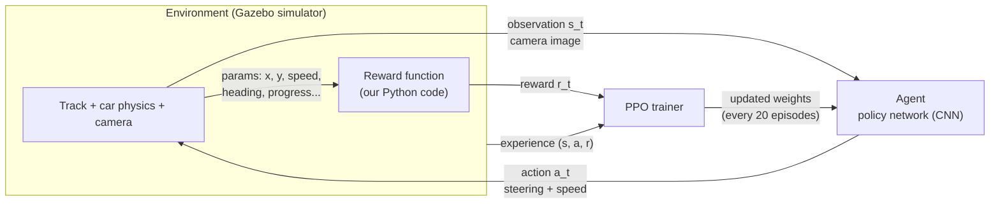

# DeepRacer as a Reinforcement Learning Problem

## The loop



At each time step t (about 15 times per second):

1. The car's camera produces an image: the **observation s_t**.
2. The policy network looks at the image and picks an **action a_t** (steering angle + speed).
3. The simulator applies the action; the car moves.
4. Our **reward function** scores that step: the **reward r_t**.
5. The experience (s_t, a_t, r_t) is stored. Every N episodes, PPO uses it to update the network.

The goal is to learn a policy π(a | s) that maximizes the **expected discounted return**:

```
G_t = r_t + γ·r_{t+1} + γ²·r_{t+2} + ...      (γ = discount factor = 0.99)
```

---

## The components

| RL concept | In DeepRacer | Notes |
|---|---|---|
| **Agent** | A convolutional neural network (the "policy") | Default: shallow CNN (3 conv layers) with a *policy head* (which action) and a *value head* (how good is this state?) |
| **Environment** | Gazebo physics simulator: track world + 1/18-scale car + camera | In DRfC this runs in the **RoboMaker** container; training runs in the **SageMaker** container |
| **Observation (state) s_t** | **Front camera image only**: 160×120 pixels, grayscale by default | See "the key insight" below |
| **Action a_t** | Steering angle + speed | **Discrete**: pick 1 of N preset (steer, speed) combos. **Continuous**: any steering in [min, max] and any speed in [min, max] |
| **Reward r_t** | Output of `reward_function(params)` | **The main thing we control** |
| **Episode** | One attempt, from start to end | Ends when: lap completed (progress = 100%), car goes off track, car reverses, or step limit reached |
| **Policy π(a \| s)** | The network's output: a probability for each action | Training shifts probability toward actions that earned more reward |
| **Algorithm** | **PPO** (Proximal Policy Optimization) | On-policy, actor-critic. "Clipped" updates keep each change small and stable |

---

## The key insight: what the agent sees vs. what the reward sees

This is the most important idea in the whole competition.

| | Sees | Available on the physical car? |
|---|---|---|
| **Agent (policy network)** | Only the camera image | Yes |
| **Reward function** | Everything: exact x/y position, waypoints, heading, speed, distance from centre, progress... | No, simulator only |

The reward function is a **teacher that only exists during training**. It has perfect knowledge of the car's position and uses it to tell the agent "that was good, that was bad." The agent must learn to reproduce good behaviour **from pixels alone**.

What this means for us:
- The reward can use any parameter, but the agent has to be able to **infer the right behaviour from the image**. If we reward something the camera can't see (like a specific waypoint index on one track), the agent learns a track-specific habit that won't transfer.
- On the **hidden track** and the **physical car**, only the image → action mapping survives. The model must have learned "white lines curve left, so steer left," not "at step 45, steer left."
- **Visual differences matter.** The real track's lighting, reflections and colours differ from the simulator. Domain randomization and training on multiple tracks help the network focus on track edges rather than simulator-specific details.

### A subtle point: partial observability

A single image doesn't show **speed** or **motion**: a car stopped on the track and a car at full speed produce the same picture. Technically this makes it a *partially observable* MDP (POMDP). In practice it works because the policy learns reactive behaviour ("this road shape means this action"). The `stack_size` hyperparameter can feed the last few frames together to give a sense of motion, at the cost of a bigger network.

---

## The reward function inputs (`params`)

Our reward function receives a dictionary each step. The most useful keys:

| Parameter | Meaning |
|---|---|
| `all_wheels_on_track` | True if all 4 wheels are on the track |
| `distance_from_center` | Metres from the centre line |
| `track_width` | Track width in metres |
| `is_left_of_center` | Which side of the centre line the car is on |
| `heading` | Car's yaw in degrees |
| `steering_angle` | Current steering in degrees (-30 to 30) |
| `speed` | Current speed in m/s |
| `progress` | % of the lap completed |
| `steps` | Steps taken in this episode |
| `waypoints`, `closest_waypoints` | Track centre-line points, and the two nearest |
| `is_offtrack`, `is_reversed`, `is_crashed` | Episode-ending conditions |
| `x`, `y` | Car position |

Full list: AWS DeepRacer developer guide, "Input parameters of the reward function".

---

## The training loop (PPO in DeepRacer)

```
repeat:
    1. Collect experience: run 20 episodes with the current policy
       (num_episodes_between_training = 20)
    2. Compute advantages: which actions did better than the value head expected?
    3. Update the network: 5 passes over the data in mini-batches of 64
       (num_epochs = 5, batch_size = 64, lr = 0.0003)
    4. Save a checkpoint, then push the new policy back to the simulator
```

### Hyperparameters and what they mean

| Hyperparameter | Default | Meaning |
|---|---|---|
| `discount_factor` (γ) | 0.99 | How far ahead the agent "cares". 0.99 ≈ ~100 steps ≈ ~7 seconds of lookahead |
| `lr` | 0.0003 | Learning rate: size of each update step |
| `beta_entropy` | 0.01 | Bonus for keeping the policy random; higher = more exploration |
| `batch_size` | 64 | Samples per gradient step |
| `num_epochs` | 5 | Passes over each batch of experience |
| `num_episodes_between_training` | 20 | Episodes collected before each update |
| `stack_size` | 1 | Number of camera frames fed at once |

---

## How this maps to our competition goals

| Goal | RL lever |
|---|---|
| Finish laps reliably (completion rate) | Reward staying on track; penalize wild steering; train from varied start positions |
| Go fast (best lap) | Reward speed and progress per step, but only once the car is reliable |
| Generalize to the hidden track | Train on multiple tracks and both directions; avoid track-specific rewards |
| Transfer to the real car | Smooth steering, moderate speed range, domain randomization, a tight action space |
